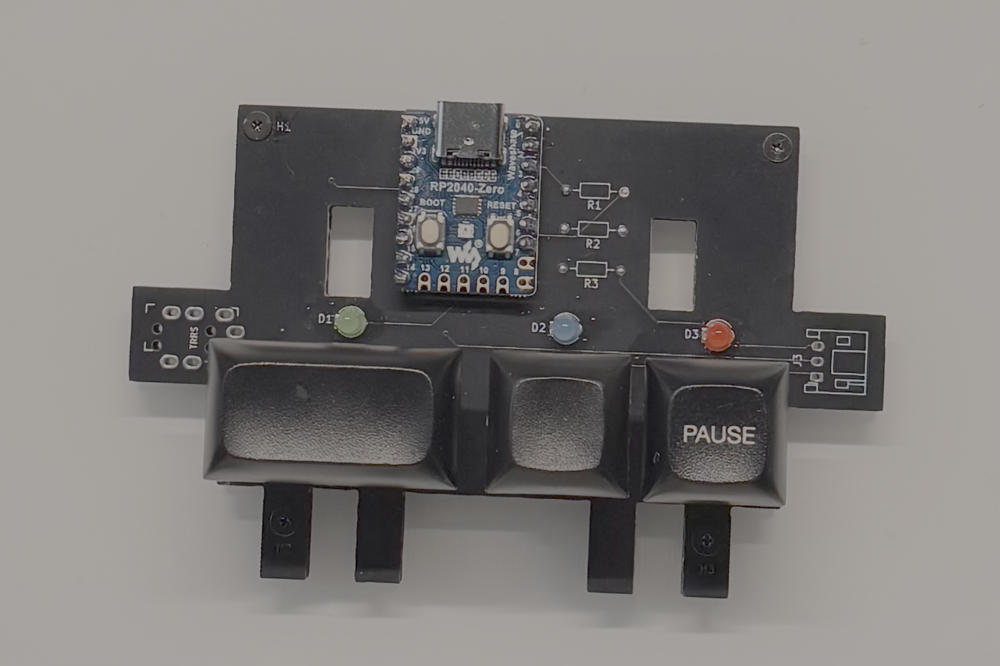

# Gavel

[日本語](README.ja.md)


A physical controller for [Claude Code](https://claude.ai/code).

**Why "Gavel"?** A judge's gavel makes decisions final — and here, the human is always the judge. Any keyboard could send the same keys, but a dedicated device makes you stop and think instead of hitting a key on autopilot. A ruling, not a reflex.

---

## What it does

- **Input** — Three physical buttons answer Claude Code's permission prompts (`1` Allow Once / `2` Always Allow / `3` Reject) without touching the keyboard.
- **Output** — LEDs light up in response to Claude Code hook events, giving real-time feedback on what Claude is doing.

---

## Hardware

Two boards are supported:

| Board | LED output |
|-------|-----------|
| Raspberry Pi Pico | 3× discrete LEDs (GP2/GP3/GP4) |
| Waveshare RP2040 Zero | Built-in RGB NeoPixel (GP16) |

Board type is auto-detected — no manual configuration needed.

Both use the same GPIO pins for buttons (GP14/GP15/GP26). See [`hardware/wiring.md`](hardware/wiring.md) for full pin assignments.



---

## How it works

The microcontroller runs two independent roles over a single USB cable:

1. **USB HID keyboard** — pressing a button sends the matching keypress to the terminal. Claude Code receives it exactly as if the user typed it. No special Claude Code configuration needed.

2. **Serial listener** — Claude Code hooks call Python scripts on the Mac side, which send small JSON messages over the microcontroller's USB serial port to control the LEDs.

| Hook | LED response |
|---|---|
| `PreToolUse` | All LEDs solid on |
| `PostToolUse` | All LEDs off |
| `Notification` (info) | Single slow flash |
| `Notification` (warn) | Three medium flashes |
| `Notification` (error) | Five fast flashes (red only) |
| `PostToolUse` (context ≥ 90%) | Three medium flashes, then off |

---

## Setup

1. Install [CircuitPython](https://circuitpython.org) on your board
2. Download the [CircuitPython library bundle](https://circuitpython.org/libraries) matching your CircuitPython version
3. Copy the following to `CIRCUITPY/lib/`:
   - `adafruit_hid/` (folder) — required for all boards
   - `neopixel.mpy` — required for Waveshare RP2040 Zero only
4. Copy `firmware/boot.py` and `firmware/code.py` to the `CIRCUITPY` drive
5. **Power cycle** the board (unplug and replug USB) so `boot.py` takes effect
6. Install the Mac-side dependency: `pip3 install pyserial`
7. Wire buttons and LEDs per [`hardware/wiring.md`](hardware/wiring.md)
8. Run `./install.sh --deploy` to register hooks in `~/.claude/settings.json`

Or use the install script:

```bash
./install.sh
```

Use `--deploy` to install hooks to `~/.claude/gavel/` — a stable location independent of the project folder path:

```bash
./install.sh --deploy
```

This is recommended if you plan to move or rename the project folder.

---

## Troubleshooting

**LEDs do not respond when running hook scripts manually from the terminal**

```
No module named 'serial'
```

`pyserial` may not be installed for the `python3` used in your terminal session. Fix with:

```bash
pip3 install pyserial
```

Note: Claude Code hooks may use a different Python environment that already has `pyserial` installed, so hooks can work in a Claude Code session even when manual terminal tests fail.

---

## License

MIT License — see [LICENSE](LICENSE) for details.
